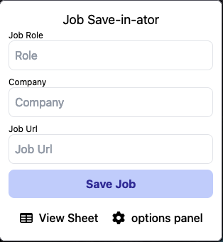
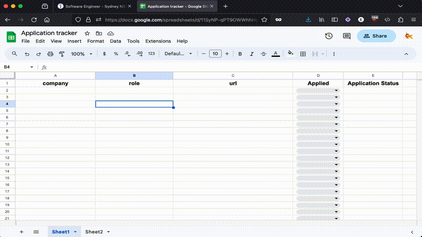

# Job saver

This is a browser extension i created to automate saving a job posting from a job board to a google spreadsheet

When opening the extension on a job listing, the extension will try to scrape the page for the role, company and job url to prefill form inputs

Currently the extension connects to a google sheet via a service account that has to be created.
In the future this would ideally be done through oauth so the user doesn't have to create a google cloud project and generate the keys for the service account


The project has been built using React, Tailwind CSS and the [Plasmo framework](https://docs.plasmo.com/) 


## Supported browsers
This extension has only been tested on **Chrome** and **Firefox** browsers


## Supported sites for prefill
Automatically fetch the job details from the page to prefill the job details form


Currently the prefill functionality supports the following sites
- [X] au.indeed.com
- [X] seek.com.au
- [X] linkedin.com

Job details can still be manually entered from sites that are not currently supported

### Quick save keyboard shortcut
On the sites supported by the automatic prefill the quick-save keyboard shortcut is available

on macOS the shortcut is `Command+Shift+S` and on everything else it's `Ctrl+Shift+S`


## What's it look like?
With no forms prefilled the extension will look like the below image

The "View Sheet" button will open the connected google sheet in a new tab.

The "Options Panel" button will open the extensions configuration page where the google sheet and json key can be configured.

<p align="center">
     
</p>

### Extension in action
the below GIF shows the extension adding a job from indeed. The form fields are prefilled from the job posting for ease of use.

When the save button is clicked the role is added to the google sheet.

<p align="center">
     
</p>


## Configuration
To configure the extension open the options screen and enter the url to the google sheet.

This will then query the api to validate that you have shared the url with the service account and it will create a new google sheet with the required headers for you.

## Development

First, run the development server:

```bash
npm run dev
```
To load the extension into the browser for development see [Loading the extension into chrome](https://docs.plasmo.com/framework#loading-the-extension-in-chrome)

If developing on firefox then the storage api will not work when adding the extension as a 'Temporary Addon' trying to use it will produce the following error
```
The storage API will not work with a temporary addon ID. Please add an explicit addon ID to your manifest. For more information see https://mzl.la/3lPk1aE.
```

## API
To save the jobs to the google sheet the accompanying REST API is required, this can be found [here](https://github.com/Zed-Bailey/job-saver-api)


## Targets
to build the extension for a different browser other then chrome you can use the `--target={manifest version}` flag
```bash
# firefox example
npm run dev -- --target=firefox-mv2
```
more information on Plasmos supported targets [can be found here](https://docs.plasmo.com/framework/workflows/faq#what-are-the-officially-supported-browser-targets)


## Making production build

Run the following:

```bash
npm run build --  --zip
```
This will create a zip bundle for chrome target ready for install.

To build the bundle for other platforms see the "Targets" section above
